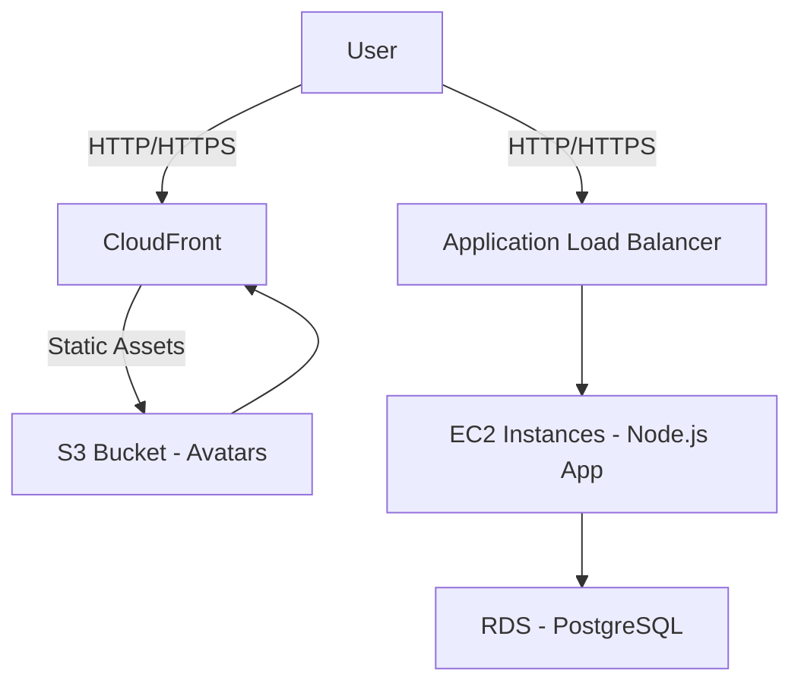
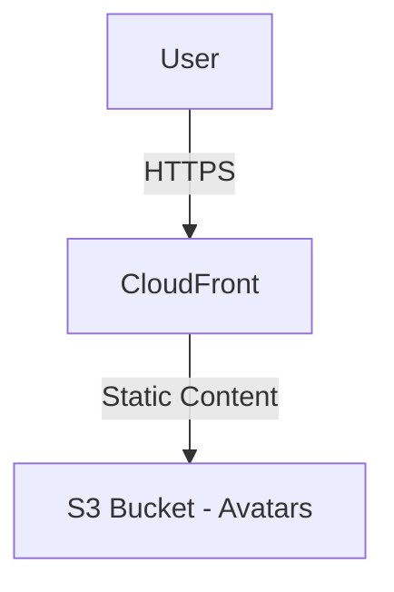
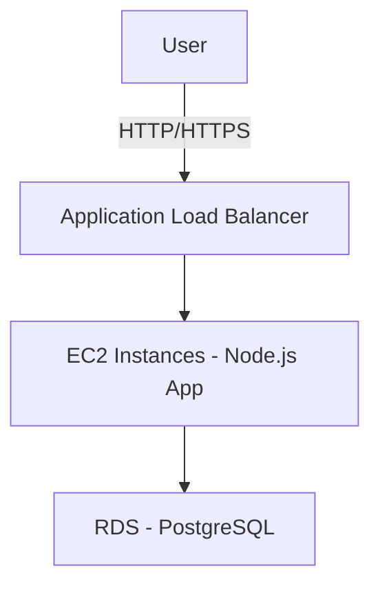

# Infrastructure Setup for Node.js Application

This document provides an overview and instructions for managing the infrastructure of our Node.js application using Terraform on AWS.

---

## Infrastructure Overview

Below is a high-level diagram of the infrastructure:



### Components

1. **CloudFront**: Distributes static assets (avatars) stored in the S3 bucket, ensuring low latency and high transfer speeds.
2. **S3 Bucket**: Stores user avatars securely.
3. **Application Load Balancer (ALB)**: Distributes incoming traffic across the EC2 instances.
4. **EC2 Instances**: Hosts the Node.js application.
5. **RDS (PostgreSQL)**: Handles relational database operations.

---

## File Structure

The infrastructure configuration is organized in the following structure:

```
infrastructure/
│
├── main.tf          # Defines resources like EC2, S3, RDS, etc.
├── variables.tf     # Input variables for customization.
├── outputs.tf       # Outputs for key resources (e.g., URLs, IDs).
├── provider.tf      # AWS provider configuration.
└── README.md        # Documentation (this file).
```

---

## Prerequisites

1. **Terraform**: Install the [latest version](https://www.terraform.io/downloads).
2. **AWS CLI**: Configure your credentials using `aws configure`.
3. **SSH Key Pair**: Ensure an existing AWS key pair for accessing EC2 instances.

---

## Setup Instructions

### Step 1: Initialize Terraform

Run the following command to initialize Terraform in the `infrastructure/` directory:

```bash
terraform init
```

### Step 2: Review the Plan

Preview the infrastructure changes that will be applied:

```bash
terraform plan
```

### Step 3: Apply Changes

Apply the Terraform configuration to provision the resources:

```bash
terraform apply
```

Type `yes` when prompted to confirm.

---

## Outputs

After applying the Terraform configuration, key resource details will be displayed:

1. **ALB DNS**: The DNS name of the Application Load Balancer.
2. **CloudFront URL**: The URL for accessing static assets via CloudFront.
3. **S3 Bucket URL**: The endpoint for the S3 bucket.

---

## Diagram Details

### CloudFront and S3



### Load Balancer and EC2



---
